### PC 10.0.0.10:
Назначаю IP и маску\
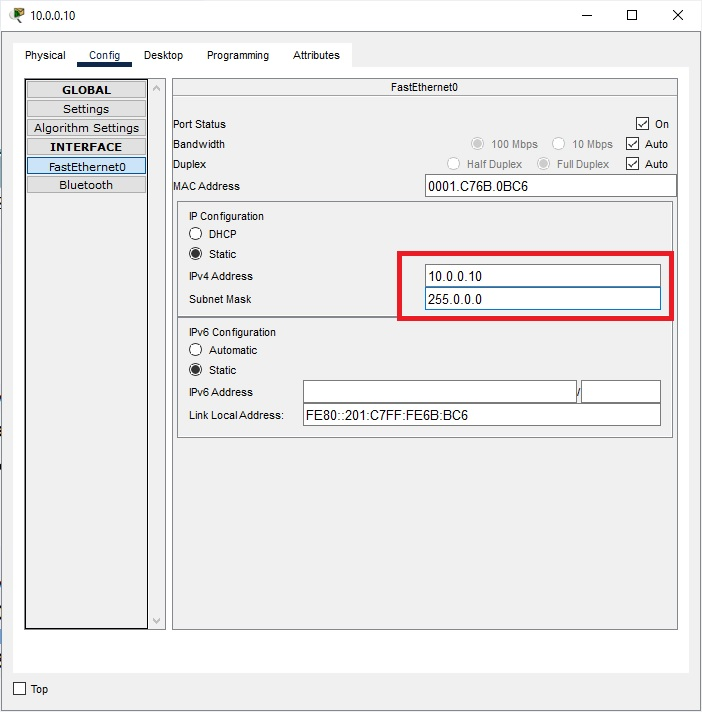\
Добавляю шлюз\
\

### PC 10.0.0.11:
Такие же действия\
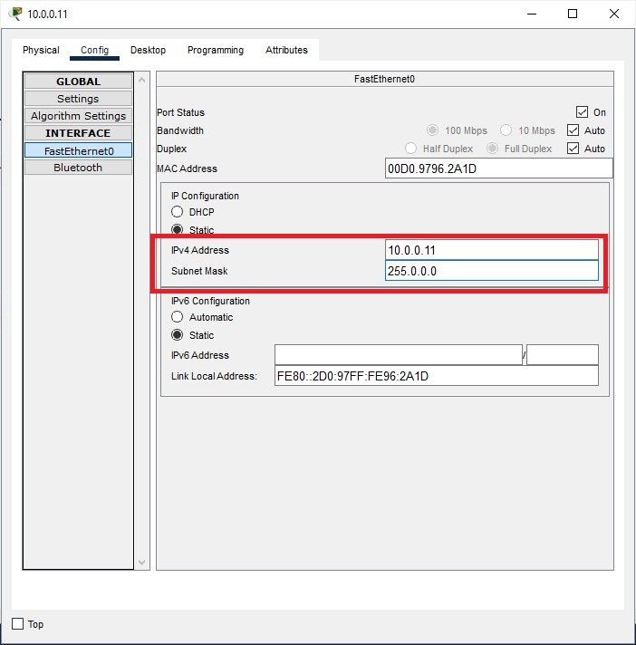\
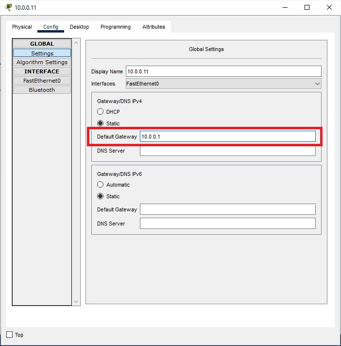\

ping c PC 10.0.0.10 на PC 10.0.0.11:\
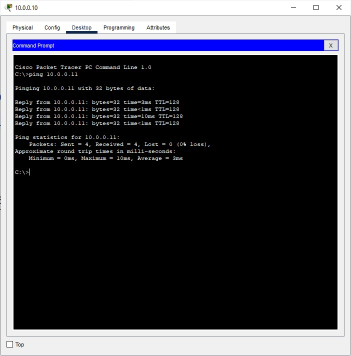\

### Роутер r1
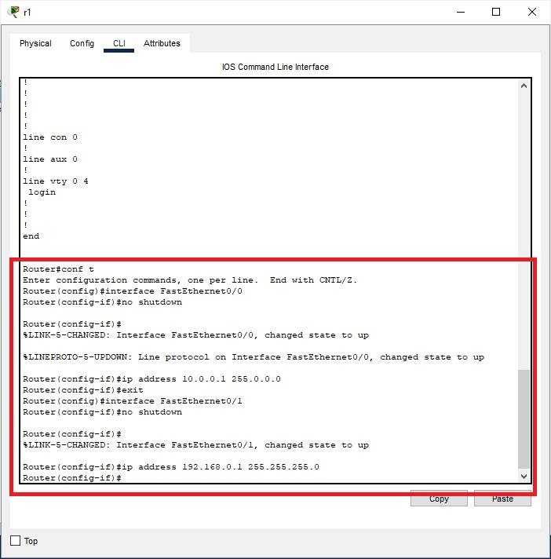\

### Роутер r2
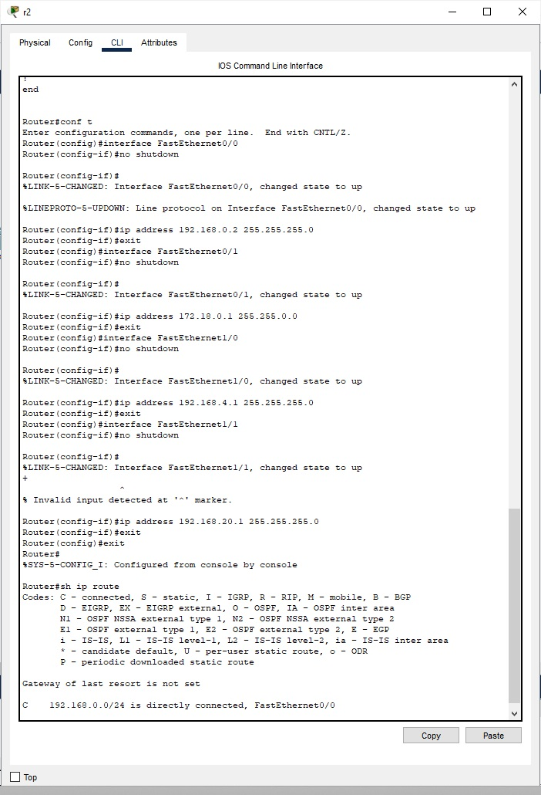\

### Роутер r3
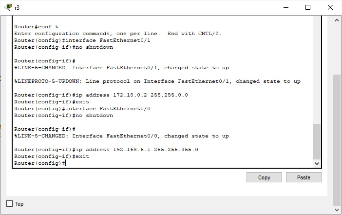\

### Роутер r4
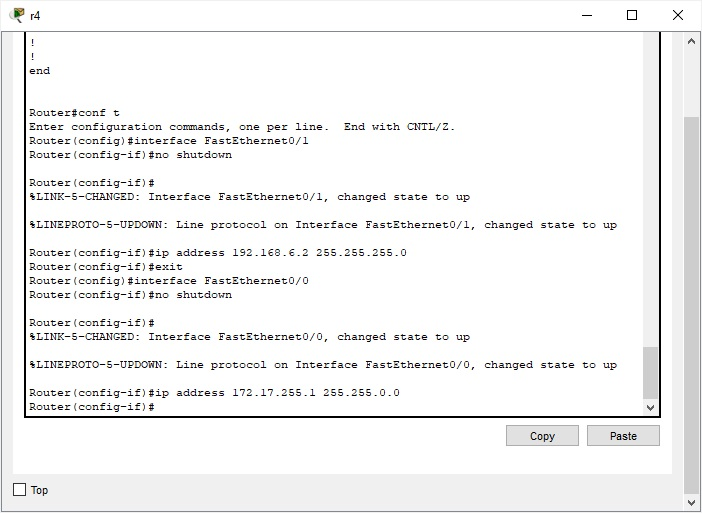\

### Server
\
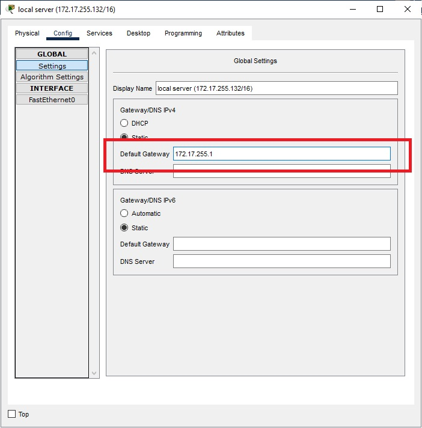\
ping на r4 Fa0/0 и Fa0/1:\
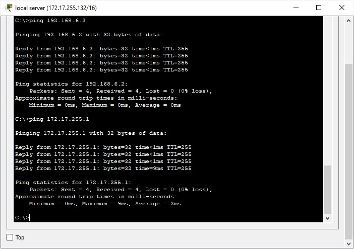\

### Роутер r4
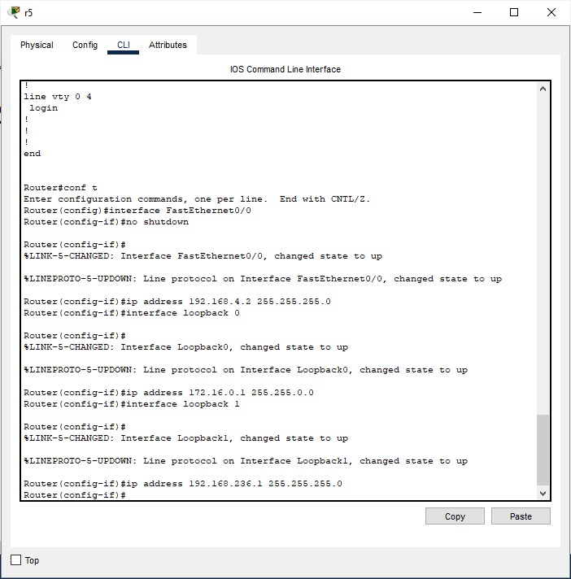\
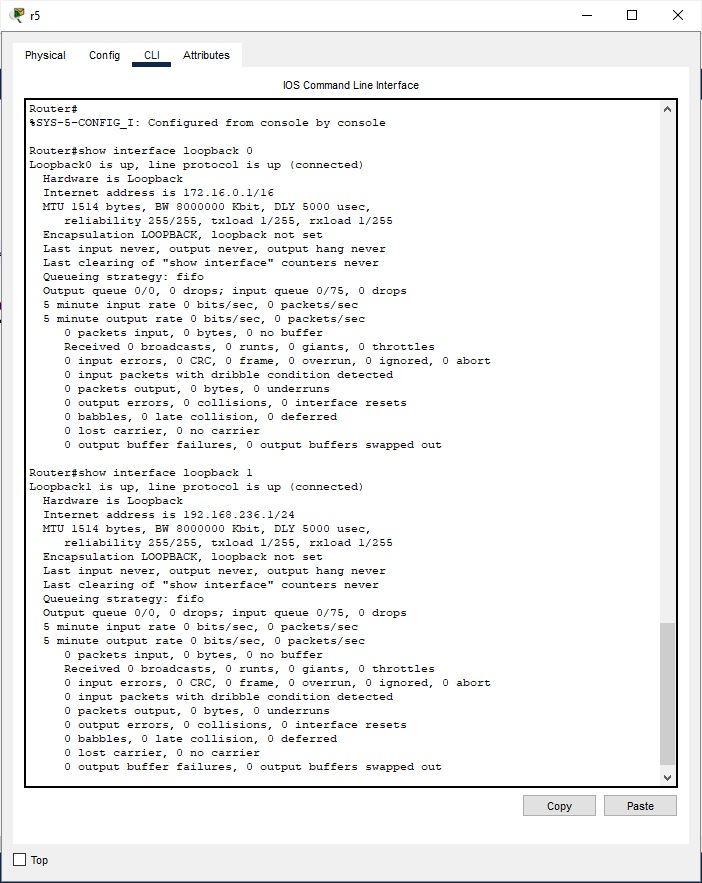\

### Роутер r5
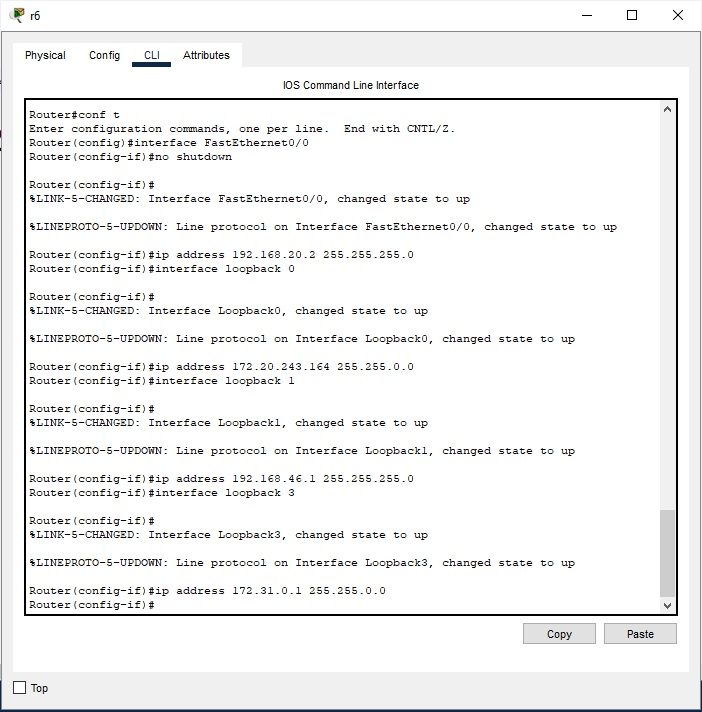\
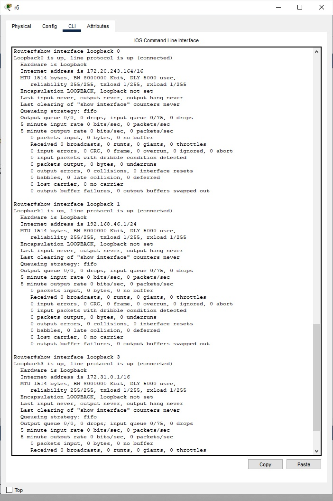\

### Broadcast домены
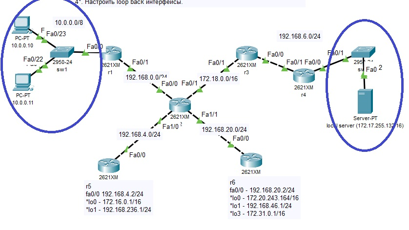

### arp таблица r2
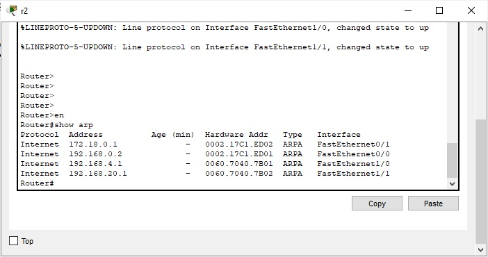

### ping PC 10.0.0.11, дальше интерфейсов r1 не видит, поскольку нужно далее прописывать маршруты:
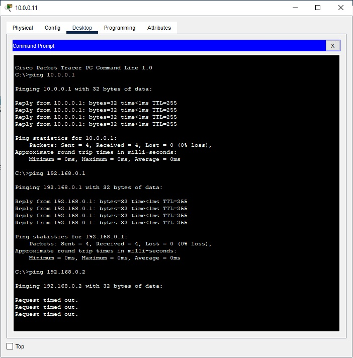